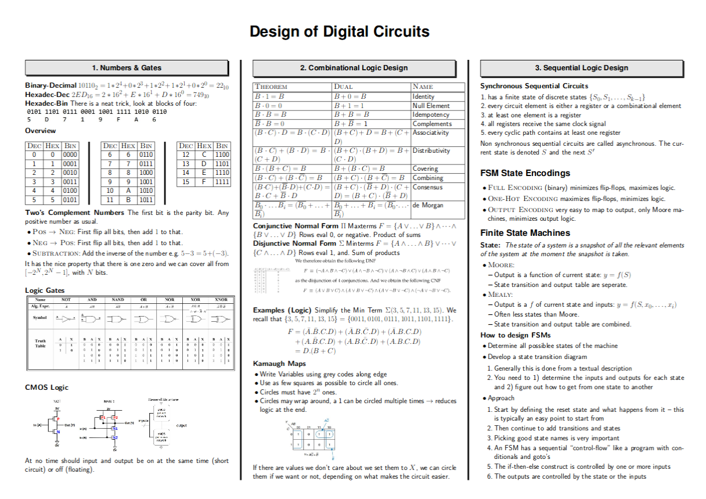
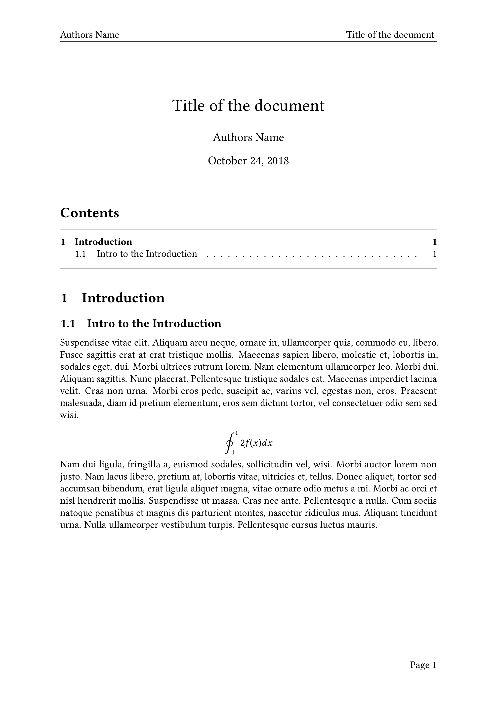

# Collection of Academic Latex Templates

# Attention - still under construction

This repository is a collection of latex templates I have used for a variety of use cases during my studies of computer science at ETHZ. 

It contains the following:

- [Exam Summary / Cheatsheet](./exam_summary/)
- [Homework Template](./homework/)
- [Lecture Notes Template](./lecture_notes/)

Feel free to fork it and submit your enhancements.

## Screenshots & Description:

| Description | Screenshot |
|-------------|------------|
| **Exam Summary / Cheatsheet** ||
| **Homework Template** ||
| **Lecture Notes Template** ||
