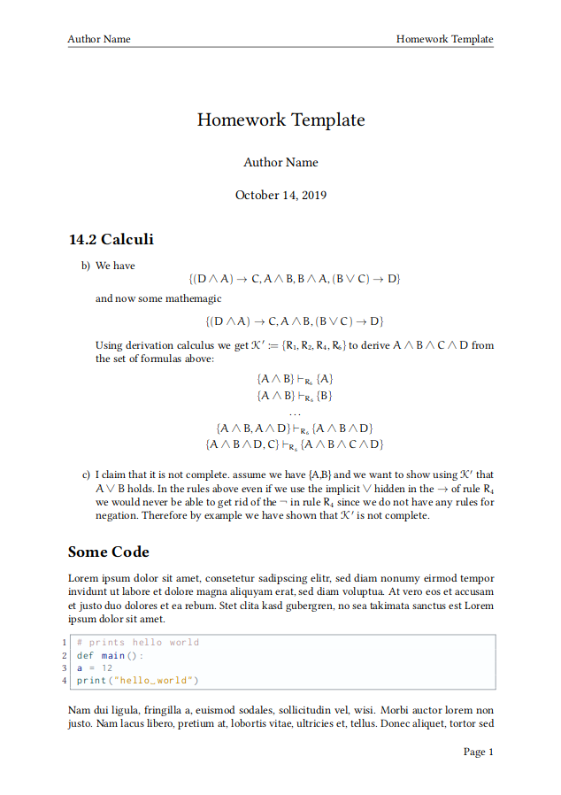

# Homework Template

## Screenshot



You can download this template and use it like any other latex template.

## Change the language

Find the line ´\usepackage[english]{babel}´ and change ´english´ to your preferred language.

## Turning the header and footer off

Find the line ´\thispagestyle{fancy}´ and delete it. 


## Adding code

Use the following syntax:

```
\begin{lstlisting}[language=Python]
def main():
	print("your code here")
\end{lstlisting}
```

